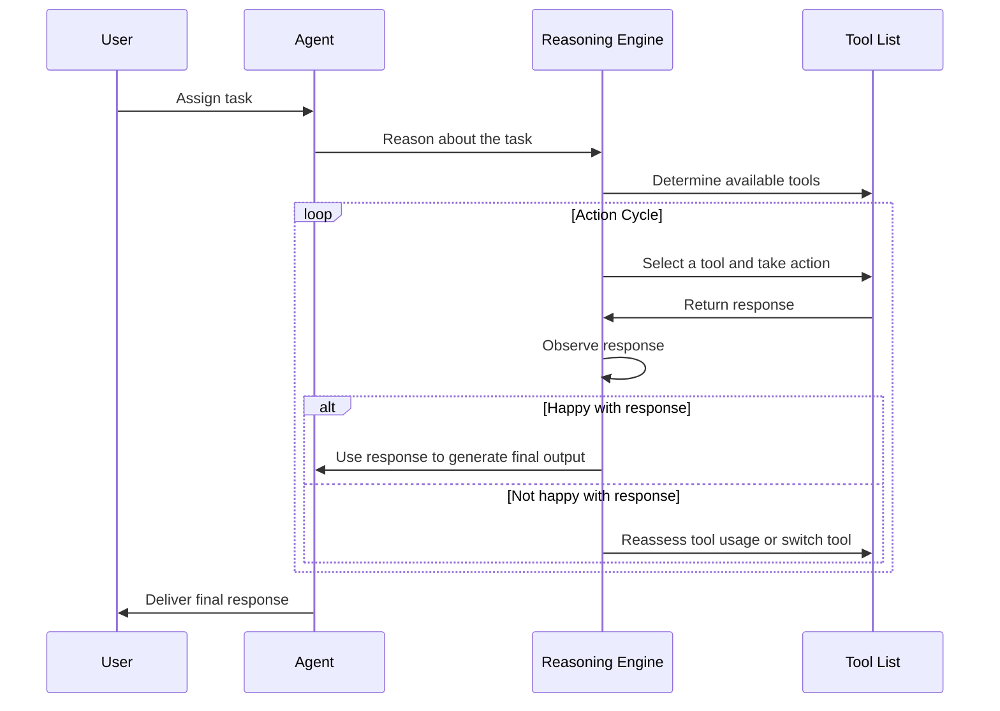

### AI Agent

- Its a software component that can do a task on its own.
- It does it using LLM intelligence and a set of Tools which we provide it.

### High level Steps
- When a user assigns a task to an agent, it'll use LLM as a "Reasoning" engine.
- It'll take the task, reason and see which tools are available on hand to accomplish this particular task.
- Then it'll take an action using the tool from the tool list which we provide.
- Get the response, it'll not straight-away use that response , it'll observe the response.
- if it's happy with the response, it'll use it to generate a final response.
- If it's not happy, it'll continue the cycle of "reasoning".
- It will once again see if it can use the same tool previously to get one more response or it has to use a completely differnet tool to get the task done.
- Finally, it's happy with the response ,it'll use the response to generate the final response.


Most of the LLMs support *Agents*.

### Agent Types
Search for `langchain agent types` in google.
There are many agent-types listed in langchain.
[agent-types](https://python.langchain.com/v0.1/docs/modules/agents/agent_types/)


### Steps to create an Agent

First step is to come up with a prompt which will drive our agent's behavior.

To do that, we don't have to create a prompt from scratch.

Thanks to Langchain, it gives us several prompts that are ready to use based on the use-case we are working on.

Since we are going to use the ReAct type agent, we'll use the `ReAct` prompt that is already available in the langchain hub.

```
from langchain import hub
# Get the prompt to use - you can modify this!
prompt = hub.pull("hwchase17/react")
```
Here's how the prompt looks : [hwchase17/react](https://smith.langchain.com/hub/hwchase17/react)

In this prompt ,we can see

we have the {tools} placeholder.

Go through the prompt to see the placeholders and the structure.

### Code Setup for ReAct Example

install packages in Pycharm
- wikipedia
  - so that our agent can work with wikipedia   
- duckduckgo-search
  - allow our agent to search the internet.
  
### Skeleton code to start with
```
import os
from langchain_openai import ChatOpenAI
from langchain import hub
import streamlit as st
from langchain.agents import create_react_agent, AgentExecutor
from langchain_community.agent_toolkits.load_tools import load_tools


OPENAI_API_KEY = os.getenv("OPENAI_API_KEY")
llm=ChatOpenAI(model="gpt-4o", api_key=OPENAI_API_KEY)


prompt = hub.pull("hwchase17/react")
```

Now we create tools object that references our two tools : wikipedia and duckduckgo
```
tools = load_tools(["wikipedia","ddg-search"])
```

Now create an agent. We need to pass llm, tools and prompt as inputs as shown below.
```
agent = create_react_agent(llm,tools,prompt);
```
Now create an agent executor
```
agent_executor = AgentExecutor(agent=agent,tools=tools,verbose=True)
```

Finally, add some streamlit code for UI
```
st.title("This is a AI agent")
task=st.text_input("assign me a task")
if task:
    response = agent_executor.invoke({"input":task})
    st.write(response["output"])
```

Final Code looks like this:
```
import os
from langchain_openai import ChatOpenAI
from langchain import hub
import streamlit as st
from langchain.agents import create_react_agent, AgentExecutor
from langchain_community.agent_toolkits.load_tools import load_tools
from numpy.f2py.crackfortran import verbose

OPENAI_API_KEY = os.getenv("OPENAI_API_KEY")
llm=ChatOpenAI(model="gpt-4o", api_key=OPENAI_API_KEY)


prompt = hub.pull("hwchase17/react")

tools = load_tools(["wikipedia","ddg-search"])
agent = create_react_agent(llm,tools,prompt)

agent_executor = AgentExecutor(agent=agent,tools=tools,verbose=True)

st.title("This is a AI agent")
task=st.text_input("assign me a task")
if task:
    response = agent_executor.invoke({"input":task})
    st.write(response["output"])
```

To see this code in action, run

`streamlit run agent_demo.py`

Unfortunately, the wikipedia or duckduckgo doesn't work due to corporate firewall issue. 
So I had to run the code in google-colab for learning purposes. 

Copy pasting a screenshot image worked as shown below!


